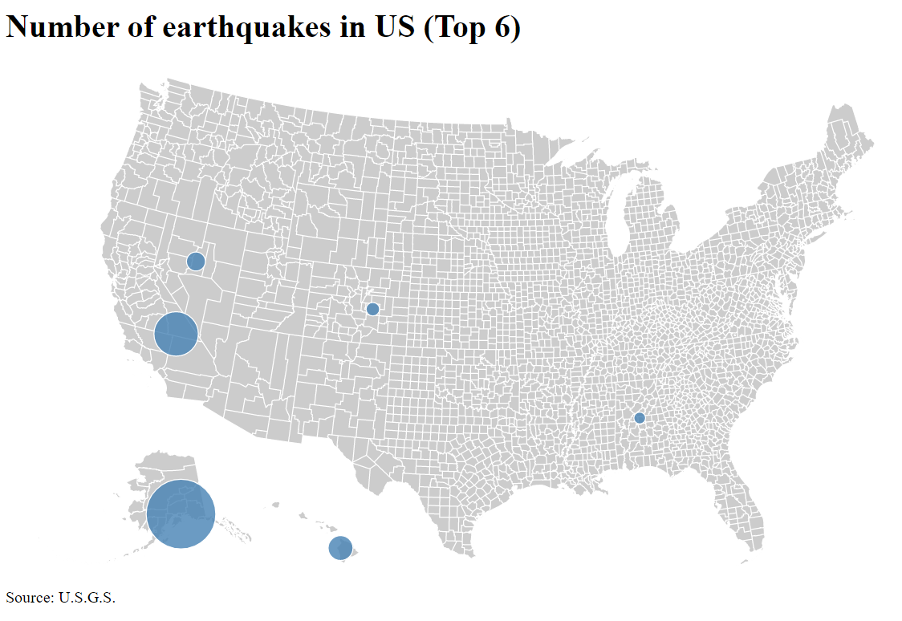
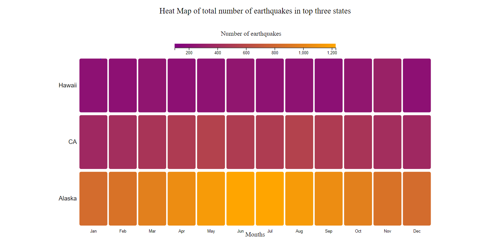

# Alpha Release        

### Background and motivation:
In the most destructive disasters list till now, two of them in the top 4 are earthquakes. In spite of having the data related to the previously happened earthquake events, it is really hard to use that data to analyze for making future predictions. There is a lot of need to know the earthquake-prone areas and where more care should be taken. The motivation for choosing the dataset is to help the scientists get to know about which are the earthquake-prone areas also for the government to be prepared for facing such unexpected disasters to reduce the loss.

### Description:
The project is an attempt to help the researchers and people interested in geospacial science about earthquakes. The project is a story telling about the earthquakes happened in United States in last 2 years (2018-01-01 to 2020-10-28). It contains 4 main visualizations.
1. Symbol map: symbol map of the regions where the earthquake strikes in 2018 and a user can select a year by filtering. Then for the same data the user can see subsequent followinf visualizations:
2. HeatMap: To analyze the trends in umber of earthquakes for particular regions.
3. Multiline chart: To analyze trends in the magnitudes of the earthquake in the selected regions.
4. Histogram: To see the trend between the magnitude of the earthquake and depth at which the earthquake struck.
This will help researchers to see functional details of the historic data about the earthquakes in USA for study.

### Overview:
The project will be composed of total four visualizations. In the first visualization, we will see the details of earthquakes in overall US and then we will move toward more deep level by considering top places where number of earthquakes is more. We will do analysis of such places using attributes like magnitude of earthquake and depth during a timestamps separately. Then, in the last visualization we will see how depth at which the earthquake struck and the ,agnitude of the earthquake are related to each other.

### Progress:
The data preprocessing is done which was a difficult task to do as data was having a lot of null values and two visualizations are done at basic level but more interaction is needed to be done. Hovering feature is enabled till now. 

## P1: What are the top three most earthquake-prone regions by the province/state in the United States?
- Once the scientists can see which are the earthquake-prone regions they can study different statistics about these areas and compare them according to how much earthquake prone the area is by getting how many earthquakes are happening in the region. Also, they can analyze which region is the most earthquake-prone of all.

As shown in revised proposal, the result is getting in symbol map. As the aim is to find the top places where number of earthquake is more, currently I am showing only top 6 places in the symbol map.

Current result for symbol maps (in d3.js)

## P2: For the top three regions, how many earthquakes struck in which months of the year?
- The researchers can analyze the changes in the number of earthquakes according to the months and can see monthly trends in the number of earthquakes.

The result is a heatmap of the top three places over all the months.

Current result for heat maps (in d3.js)
 

### Upcoming immediate milestones

- `(Week 3)` P2 will be added
- `(Week 3)` P3 will be added and all sync up will be done

### Roadblocks
- The dataset has lots of outliers and takes time to process.

### Beta release
[Go to beta release](code/betarelease.html)

